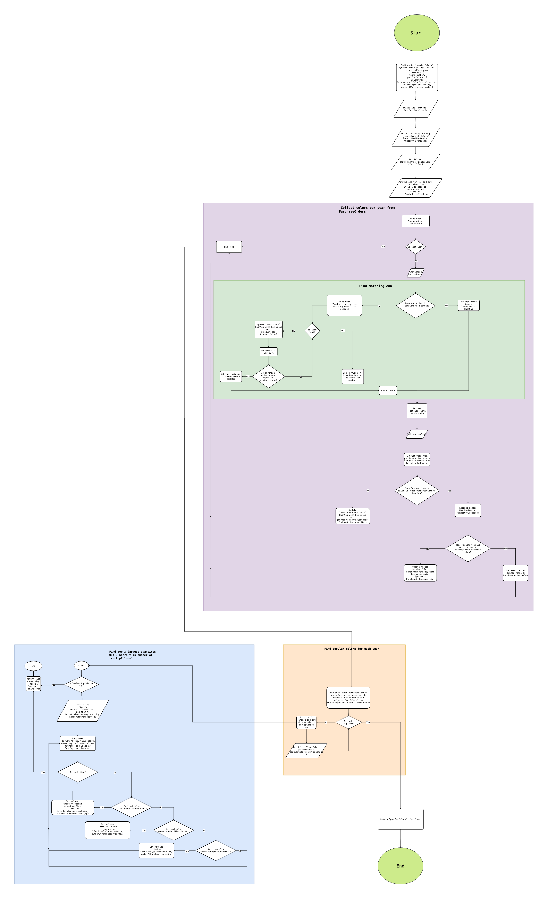

# Fashion Cloud Assignment: think

Check [flowchart](flowchart.png).

## Overall complexity
### Labels
- n: number of PurchaseOrders
- m: number of Products
- y: number of years
- c: number of unique colors for each year

### Worst case
- Time: O(n + nm + yc log c)
- Space: O(n + y*c)

### Average case
- Time: O(n + m + yc log c)
- Space: O(n + m + y*c)

Note: By creating a hashmap for the proceeded products, the overall lookup time for finding a product by its ean becomes O(1). Check green block "Find matching ean".

## Flowchart
